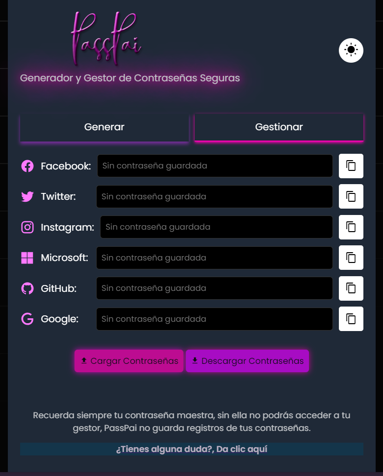
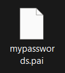
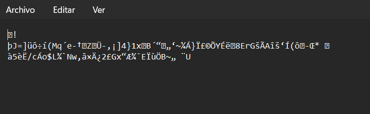

[]([./LICENSE](https://github.com/Rawierdt/PassPai/blob/main/LICENSE))


# PassPai

## Secure Password Manager
**PassPai** es una herramienta para la generación y gestión de contraseñas de codigo abierto que permite la generación de contraseñas seguras gracias a la encriptación  AES-256

> [!NOTE]
> Disclaimer: This tool was created for individual purposes only. Any extended use of this tool to companies will incur charges.

<p align="center">
    
    
</p>

<p align="center">
    
    
</p>

## Lastest Version
**N/A**

## Features

- **Generación de Contraseñas**: Crea contraseñas seguras para distintas redes sociales. 😄
- **Gestión de Contraseñas**: Guarda y visualiza contraseñas para diversas cuentas.
- **Interfaz Adaptativa**: Alterna entre un tema claro y oscuro. 🌸
- **Diseño Moderno**: Interfaz limpia con un fondo sutil y efectos visuales atractivos. 🌸
- **Descarga de Archivos**: Posibilidad de descargar los archivos generados a nivel local.
- **Carga de Archivos**: Gracias a ello podra cargar archivos de forma segura y ver sus contraseñas.
- **Seguridad en Nube**: Podrá acceder a sus contraseñas de forma segura **sin necesidad de descargar programas adicionales**. ☁️
- **Seguridad a Nivel Militar**: La encriptación **AES-256** protege sus contraseñas contra ataques o robos. 🔒
- **Uso de Contraseña Maestra**: Solo necesita recordar una contraseña para acceder a las otras. 🔑

## 📦 Requirements

- **Browser**

- **5 MB disk space**

## 💻 Installation

Para instalar y ejecutar KeyForge localmente, sigue estos pasos:

1. **Clona el repositorio**:

    ```bash
    git clone https://github.com/Rawierdt/PassPai.git
    ```

2. **Navega al directorio del proyecto**:

    ```bash
    cd PassPai
    ```

3. **Instala las dependencias** (si aplica):

    ```bash
    npm install
    ```

4. **Abre el proyecto en tu navegador**:

    Abre el archivo `index.html` en tu navegador para ver la aplicación en acción.

## 🎴 Usage

1. **Generar Contraseñas**: Ve a la pestaña "Generar" y haz clic en "Generar" para crear una nueva contraseña.
2. **Gestionar Contraseñas**: En la pestaña "Gestionar", puedes ver y copiar contraseñas guardadas para diferentes redes sociales.

## 🔒 Configuración de Contraseña Maestra

- **Descargar Contraseñas**: Al descargar el archivo con las contraseñas se le pedira asignar una contraseña maestra. Una vez creada se descargará un archivo llamado **mypasswords** (*puede cambiar el nombre del archivo a su gusto*) con la extención **.pai**.
- **Cargar Contraseñas**: Si desea consultar sus contraseñas, deberá cargar su archivo con extensión **.pai** y escribir su contraseña maestra (*sin ella el archivo no se cargará y deberá intentar de nuevo*).

## 🤝 Contributing

Contributions, issues and feature requests are welcome! Feel free to check issues page.

1. **Haz un Fork del Repositorio**: Crea una copia del repositorio en tu cuenta de GitHub.
2. **Crea una Rama**: 

    ```bash
    git checkout -b nombre-de-tu-rama
    ```

3. **Haz tus Cambios**: Realiza las modificaciones que deseas agregar.
4. **Commit y Push**:

    ```bash
    git add .
    git commit -m "Descripción de los cambios"
    git push origin nombre-de-tu-rama
    ```

5. **Crea un Pull Request**: Abre un Pull Request desde tu rama a la rama principal del repositorio.

### ❤️ Show your support

Give a ⭐️ if this _project helped you!_ 

### 💜 License

Copyright © 2024 [Rawier](https://rawier.vercel.app). This project is [MIT](/LICENSE) licensed.

---
